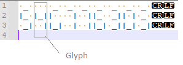

# Coding Dojo - Bank OCR solution
Solution for https://code.joejag.com/coding-dojo/bank-ocr/ coding dojo problem.

 

# Description of operation

## Input format
* Sample input, should produce `54?77630? ILL` response:

## Recognition worfklow
Implemented in BankOcr.Parser.RecognitionWorkflow, using several isolated stateless modules (processing stages). Few stages use [OneOf](https://github.com/mcintyre321/OneOf) (discriminated union) of possible outcomes to avoid exception handling and complex flow control:

### Stage 1 - Parsing text input into "glyphs"
* Each 3x3 block of text (fourth line is empty) is converted into a string of length 9, without line breaks. E.g. number 0 produces ` _ | ||_| `.
* *GlyphEnumerator* converts nine 3 x 3 blocks into collection of nine strings.

### Stage 2 - Recognizing digits
* Each glyph is compared with prepopulated list of prototypes
* *DigitRecognizer* converts each input string into *RecognitionResult*, which is either *RecognizedGlyph* or *UnrecognizedGlyph*.
* Recognition is optimized by using a dictionary where the key is actual glyph string.

### Stage 3 - Validating account number
* RecognitionResults are passed into *AccountNumberValidator* which checks for unrecognized glyphs and calculates account number checksum.
* It returns *AccountNumber*, which is either *ValidAccountNumber* or *InvalidAccountNumber* (with several subtypes).

### Stage 4 - Account number correction
* If previous step resulted with *InvalidAccount* of either *UnrecognizedDigits* or *InvalidChecksum* subtype, it attempts to find another correct account number than can be created either by adding or removing a single dash or pipe (called *stroke* in the code).
* Both cases have the same base algorithm which focuses on a single digit from the account number. It checks other glyph prototypes and accepts candidates that produce valid checksum.
* For the *UnrecognizedDigits* subtype it can correct only one missing digit, while for *InvalidChecksum* it iteratively checks *AccountNumber's* digits and finds valid alternatives for all of them.
* Finding alternatives is optimized by limiting number of digits to check to only small number of glyph prototypes having similar (i.e. +/- 1) number of strokes.

### Stage 5 - Output formatting
* Depending on previous steps, the *AccountNumberFormatter* accepts *AccountNumber* type which is one of ValidAccountNumber, InvalidAccountNumber or AmbiguousAccountNumer.
* It converts it according to the type to final string representation.
